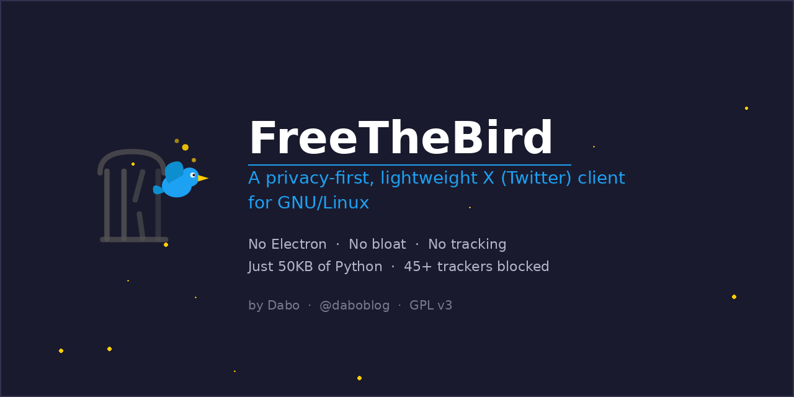
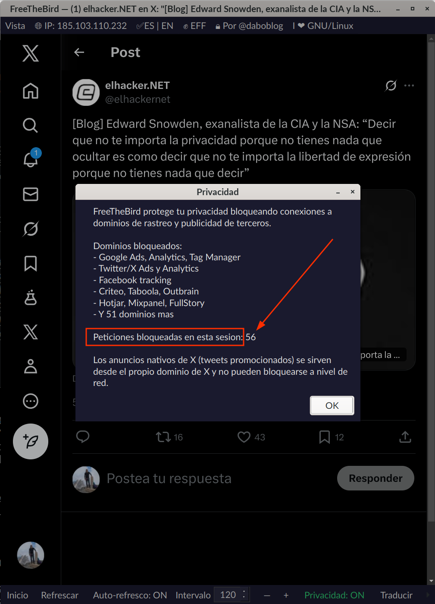
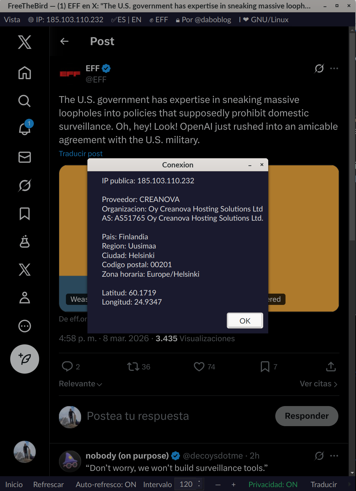

<p align="center">
  
</p>

<p align="center">
  <a href="https://x.com/daboblog">X: @daboblog</a> · 
  <a href="https://bsky.app/profile/daboblog.bsky.social">Bluesky: @daboblog</a> · 
  <a href="https://davidhernandez.es">davidhernandez.es</a> · 
  <a href="https://daboblog.com">daboblog.com</a>
</p>

---

**[English version (README_EN.md)](README_EN.md)**

## Por qué existe FreeTheBird

No voy a engañar a nadie: estoy muy fuera de la órbita de X. Lo que ha pasado con Twitter me parece un desastre, y creo que la mayoría de la comunidad de software libre y ciberseguridad piensa algo parecido. Pero también soy realista. X sigue siendo, a día de hoy, un lugar donde pasan cosas. Donde se rompen noticias, donde la comunidad tech debate, donde mucha gente que me interesa sigue publicando. A veces necesitas entrar, leer, participar en la conversación, y salir.

El problema es **cómo** entras.

La web de X es un monstruo de rastreo. Cada clic, cada scroll, cada segundo que pasas ahí está siendo monitorizado, perfilado y vendido. Y las alternativas de escritorio que existen para GNU/Linux son, en su mayoría, wrappers basados en Electron: un Chromium entero empaquetado por cada aplicación, comiendo 300-500MB de RAM para hacer exactamente lo mismo que un navegador.

Busqué una solución ligera, nativa, que respetase mi privacidad y no tratase mi equipo como si tuviese recursos infinitos. No la encontré. Así que la hice.

## Qué es FreeTheBird

FreeTheBird es un cliente ligero para X (Twitter) construido con **PyQt6 + QtWebEngine**. Un solo archivo Python de 50KB que usa las librerías Qt del sistema. Sin Electron. Sin `node_modules`. Sin 150MB de runtime empaquetado. Sin rastreo.

El nombre es un acto de protesta y una declaración de intenciones: **liberar al pájaro** que fue enjaulado.

## Qué aporta frente a Electron

| | FreeTheBird | Clientes Electron |
|---|---|---|
| **RAM** | ~150-200MB | 300-500MB |
| **Instalación** | 50KB (1 archivo .py) | 80-150MB |
| **Bloqueo de trackers** | Sí, a nivel de red | No |
| **Dependencias** | Qt6 del sistema | Chromium empaquetado |
| **Node.js** | No necesario | Obligatorio |
| **Auditable** | 1 archivo, legible | Miles de dependencias |
| **Integración Linux** | Nativa (Qt) | Variable |

## Funcionalidades

### Privacidad a nivel de red

FreeTheBird intercepta cada petición HTTP antes de que salga de la aplicación. Más de 45 dominios de publicidad y rastreo están bloqueados, incluyendo Google Ads, Analytics, Tag Manager, Twitter/X Ads, Facebook tracking, Criteo, Taboola, Outbrain, Hotjar, Mixpanel, FullStory y muchos más. Un indicador en la barra inferior muestra el estado de protección y el número de peticiones bloqueadas en la sesión.

### Interfaz bilingüe (Español / English)

Cambio de idioma en caliente, sin reiniciar. Toda la interfaz se actualiza al instante: menús, toolbar, bandeja del sistema y diálogos.

### Tema oscuro y claro

Cambio entre modo oscuro y claro con un clic, aplicado a toda la interfaz.

### Información de conexión

Tu IP pública se muestra en la barra de menú. Al hacer clic puedes ver detalles completos de tu conexión: ISP, organización, país, región, ciudad, zona horaria y coordenadas. Útil si trabajas con VPNs o quieres verificar tu punto de salida.

### Traductor integrado

Selecciona cualquier texto en la página y tradúcelo sin salir de la aplicación. Usa la API de Google Translate y muestra el resultado en un diálogo junto con el texto original.

### Auto-refresco configurable

Refresco automático con intervalo ajustable de 10 a 3600 segundos. Activable desde la toolbar, la bandeja del sistema o con `Ctrl+R`.

### Zoom persistente

Zoom ajustable con `Ctrl++`, `Ctrl+-`, `Ctrl+0` y botones en la toolbar. El nivel se guarda entre sesiones.

### Bandeja del sistema

Al cerrar la ventana, la app se minimiza a la bandeja en lugar de cerrarse. Incluye notificaciones cuando hay nuevos mensajes en X.

### Enlaces externos seguros

Todos los enlaces que apuntan fuera de X se abren automáticamente en el navegador del sistema. Nada se carga dentro de la app que no sea de X o sus CDN de medios.

### Atajos de teclado

```
F5           Refrescar
Ctrl+R       Auto-refresco on/off
Ctrl+H       Inicio / Timeline
Ctrl+M       Mensajes
Ctrl+N       Notificaciones
Ctrl+Q       Salir
F11          Pantalla completa
Ctrl++/-     Zoom in / out
Ctrl+0       Zoom 100%
```

### Línea de comandos

```
python3 freethebird.py                      # Inicio por defecto
python3 freethebird.py --no-refresh         # Sin auto-refresco
python3 freethebird.py --refresh 60         # Refresco cada 60s
python3 freethebird.py --purge              # Limpiar caché
python3 freethebird.py --width 1400 --height 900
```

## Instalación

Dependencias:

```bash
sudo apt install python3-pyqt6 python3-pyqt6.qtwebengine python3-pyqt6.qtsvg
```

Descarga y ejecución:

```bash
git clone https://github.com/daboblog/FreeTheBird.git
cd FreeTheBird
python3 freethebird.py
```

### Integración con el escritorio (opcional)

```bash
# Copiar iconos
sudo cp freethebird_128.png /usr/share/icons/hicolor/128x128/apps/freethebird.png
sudo cp freethebird_256.png /usr/share/icons/hicolor/256x256/apps/freethebird.png
sudo cp freethebird_512.png /usr/share/icons/hicolor/512x512/apps/freethebird.png
sudo gtk-update-icon-cache /usr/share/icons/hicolor/

# Crear entrada en el menú de aplicaciones
cat > ~/.local/share/applications/freethebird.desktop << 'EOF'
[Desktop Entry]
Name=FreeTheBird
Comment=Privacy-first X (Twitter) client for GNU/Linux
Exec=python3 /ruta/a/freethebird.py
Icon=freethebird
Terminal=false
Type=Application
Categories=Network;InstantMessaging;
Keywords=twitter;x;social;freethebird;
StartupWMClass=freethebird
EOF

update-desktop-database ~/.local/share/applications/
```

## Capturas de pantalla

<p align="center">
  
</p>

<p align="center">
  
</p>

## Nota importante

FreeTheBird bloquea trackers y publicidad de terceros a nivel de red, pero **no puede bloquear los anuncios nativos de X** (tweets promocionados), ya que estos se sirven desde el propio dominio de X.

## Sobre el autor

Soy [David Hernández (Dabo)](https://davidhernandez.es), profesional del Hacking y la administración de servidores web GNU/Linux. Ponente en los principales eventos del país (RootedCON, ConectaCON, MorterueloCON, ENISE, QurtubaCON). Llevo más de 20 años trabajando con GNU/Linux en mi escritorio y los Servers. Donde huela a Debian y Software Libre, me podrás ver ;)

FreeTheBird nace de una necesidad real: poder acceder a X cuando hace falta, sin renunciar a la privacidad ni a los principios que defiendo. Todo ello partiendo de la base de que vengo de ese Twitter que molaba que ya nunca volverá y menos en las manos de alguien tan peligroso como Elon Musk y llevo como un año sin apenas participar (y no tengo claro si lo haré, salvo para protestar).

- [@daboblog en X](https://x.com/daboblog)
- [@daboblog en Bluesky](https://bsky.app/profile/daboblog.bsky.social)
- [davidhernandez.es](https://davidhernandez.es)
- [daboblog.com](https://daboblog.com)
- [APACHEctl](https://apachectl.com) -- Mi empresa
- [Debian Hackers](https://debianhackers.net)

## Licencia

[GPL v3](LICENSE) -- Copyleft. Este software es libre y debe seguir siéndolo. Puedes usar, estudiar, modificar y distribuir este código, pero las obras derivadas deben mantener la misma licencia. Porque la libertad del software no se negocia.

---

<p align="center">
  <code>I &lt;3 GNU/Linux</code>
</p>
