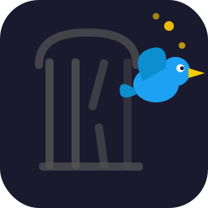

<p align="center">
  
</p>

<h1 align="center">FreeTheBird</h1>

<p align="center">
  <strong>A privacy-first, lightweight X (Twitter) client for GNU/Linux</strong><br>
  No Electron. No bloat. No tracking. Just 50KB of Python.
</p>

<p align="center">
  <a href="https://x.com/daboblog">X: @daboblog</a> · 
  <a href="https://bsky.app/profile/daboblog.bsky.social">Bluesky: @daboblog</a> · 
  <a href="https://davidhernandez.es">davidhernandez.es</a> · 
  <a href="https://daboblog.com">daboblog.com</a>
</p>

---

**[Versión en Español (README.md)](README.md)**

## Why FreeTheBird exists

I won't sugarcoat it: I'm mostly out of X's orbit. What happened to Twitter is a disaster, and I think most of the free software and cybersecurity community feels the same way. But I'm also a realist. X is still, today, a place where things happen. Where news breaks, where the tech community debates, where many people I care about still post. Sometimes you need to get in, read, join the conversation, and get out.

The problem is **how** you get in.

X's website is a tracking monster. Every click, every scroll, every second you spend there is being monitored, profiled and sold. And the desktop alternatives available for GNU/Linux are mostly Electron-based wrappers: an entire Chromium packaged per application, eating 300-500MB of RAM to do exactly the same thing a browser does.

I looked for a lightweight, native solution that respected my privacy and didn't treat my machine as if it had infinite resources. I didn't find one. So I built it.

## What is FreeTheBird

FreeTheBird is a lightweight X (Twitter) client built with **PyQt6 + QtWebEngine**. A single 50KB Python file that uses the system's Qt libraries. No Electron. No `node_modules`. No 150MB packaged runtime. No tracking.

The name is an act of protest and a statement of intent: **free the bird** that was caged.

## What it brings vs Electron

| | FreeTheBird | Electron clients |
|---|---|---|
| **RAM** | ~150-200MB | 300-500MB |
| **Install size** | 50KB (1 .py file) | 80-150MB |
| **Tracker blocking** | Yes, network-level | No |
| **Dependencies** | System Qt6 | Bundled Chromium |
| **Node.js** | Not needed | Required |
| **Auditable** | 1 file, readable | Thousands of deps |
| **Linux integration** | Native (Qt) | Variable |

## Features

### Network-level privacy

FreeTheBird intercepts every HTTP request before it leaves the application. Over 45 advertising and tracking domains are blocked, including Google Ads, Analytics, Tag Manager, Twitter/X Ads, Facebook tracking, Criteo, Taboola, Outbrain, Hotjar, Mixpanel, FullStory and many more. An indicator in the bottom bar shows the protection status and the number of blocked requests in the session.

### Bilingual interface (Spanish / English)

Hot-swap language without restarting. The entire interface updates instantly: menus, toolbar, system tray and dialogs.

### Dark and light theme

Switch between dark and light mode with a single click, applied across the entire interface.

### Connection info

Your public IP is shown in the menu bar. Click to see full connection details: ISP, organization, country, region, city, timezone and coordinates. Useful if you work with VPNs or want to verify your exit point.

### Built-in translator

Select any text on the page and translate it without leaving the app. Uses the Google Translate API and shows the result in a dialog alongside the original text.

### Configurable auto-refresh

Automatic refresh with adjustable interval from 10 to 3600 seconds. Toggle from the toolbar, system tray or with `Ctrl+R`.

### Persistent zoom

Adjustable zoom with `Ctrl++`, `Ctrl+-`, `Ctrl+0` and toolbar buttons. The level is saved between sessions.

### System tray

When closing the window, the app minimizes to the tray instead of quitting. Includes notifications when there are new messages on X.

### Safe external links

All links pointing outside X automatically open in the system browser. Nothing loads inside the app that isn't from X or its media CDNs.

### Keyboard shortcuts

```
F5           Refresh
Ctrl+R       Auto-refresh on/off
Ctrl+H       Home / Timeline
Ctrl+M       Messages
Ctrl+N       Notifications
Ctrl+Q       Quit
F11          Fullscreen
Ctrl++/-     Zoom in / out
Ctrl+0       Zoom 100%
```

### Command line

```
python3 freethebird.py                      # Default start
python3 freethebird.py --no-refresh         # No auto-refresh
python3 freethebird.py --refresh 60         # Refresh every 60s
python3 freethebird.py --purge              # Clear cache
python3 freethebird.py --width 1400 --height 900
```

## Installation

Dependencies:

```bash
sudo apt install python3-pyqt6 python3-pyqt6.qtwebengine python3-pyqt6.qtsvg
```

Download and run:

```bash
git clone https://github.com/daboblog/FreeTheBird.git
cd FreeTheBird
python3 freethebird.py
```

### Desktop integration (optional)

```bash
# Copy icons
sudo cp freethebird_128.png /usr/share/icons/hicolor/128x128/apps/freethebird.png
sudo cp freethebird_256.png /usr/share/icons/hicolor/256x256/apps/freethebird.png
sudo cp freethebird_512.png /usr/share/icons/hicolor/512x512/apps/freethebird.png
sudo gtk-update-icon-cache /usr/share/icons/hicolor/

# Create application menu entry
cat > ~/.local/share/applications/freethebird.desktop << 'EOF'
[Desktop Entry]
Name=FreeTheBird
Comment=Privacy-first X (Twitter) client for GNU/Linux
Exec=python3 /path/to/freethebird.py
Icon=freethebird
Terminal=false
Type=Application
Categories=Network;InstantMessaging;
Keywords=twitter;x;social;freethebird;
StartupWMClass=freethebird
EOF

update-desktop-database ~/.local/share/applications/
```

## Screenshots

<p align="center">
  
</p>

<p align="center">
  
</p>

## Important note

FreeTheBird blocks third-party trackers and ads at the network level, but **cannot block native X ads** (promoted tweets), as those are served from X's own domain.

## About the author

I'm [David Hernández (Dabo)](https://davidhernandez.es), a professional in Hacking and GNU/Linux web server administration. Speaker at major events in Spain (RootedCON, ConectaCON, MorterueloCON, ENISE, QurtubaCON). I've been working with GNU/Linux on my desktop and servers for over 20 years. Wherever there's Debian and Free Software, you'll find me ;)

FreeTheBird was born from a real need: being able to access X when necessary, without giving up my privacy or the principles I stand for. All of this coming from someone who misses the old Twitter that will never come back, especially not in the hands of someone as dangerous as Elon Musk. I've barely participated for about a year now (and I'm not sure if I will, except to protest).

- [@daboblog on X](https://x.com/daboblog)
- [@daboblog on Bluesky](https://bsky.app/profile/daboblog.bsky.social)
- [davidhernandez.es](https://davidhernandez.es)
- [daboblog.com](https://daboblog.com)
- [APACHEctl](https://apachectl.com) -- My company
- [Debian Hackers](https://debianhackers.net)

## License

[GPL v3](LICENSE) -- Copyleft. This software is free and must remain so. You can use, study, modify and distribute this code, but derivative works must keep the same license. Because software freedom is non-negotiable.

---

<p align="center">
  <code>I &lt;3 GNU/Linux</code>
</p>
